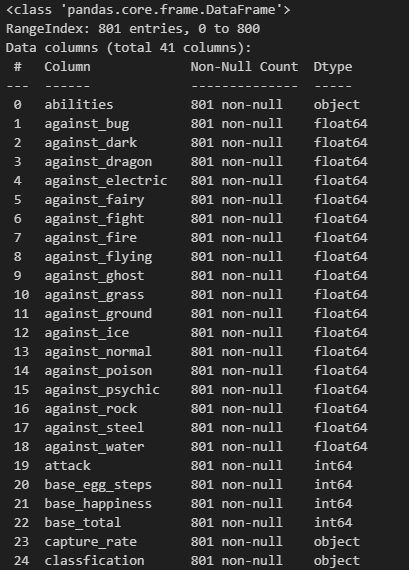
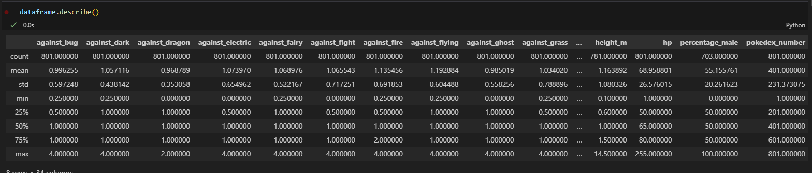
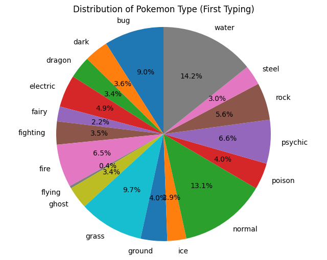
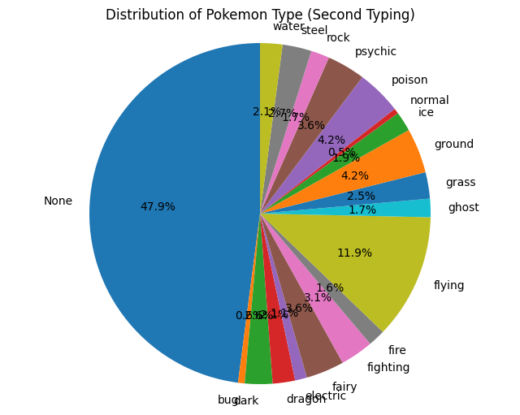
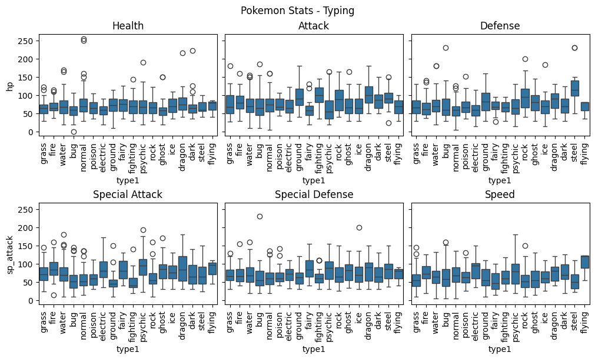
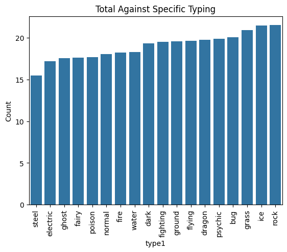

# Pokemon Data Set Analysis

## Summary
### Summary of Data

    Currently the dataset has a low amount of data itself (801) with 40 features. Of these 40 feautures, 6 of them are categorical ranging from Nominal to Ordinal typing.

     This dataset revolves around Pokemon from Generation 1st to 7th generation. The dataset itself was provided through Kaggle and from there was scarped off of a website (scerebii.net). The dataset provides a large amount of information, such as Typing (both primary and secondary where applicable), basic stats of said pokemon, as well as damage values based upon typing. There are specific values that are missing, such as if a pokemon is an evolution. This could be something that could be a target moving forward and is quite easy to provide this additional feature since the data itself is quite easy to understand. 

    Above is the output of a basic summary statistic of the dataset itself. In the following section I will run through the plan for how I will be doing exploratory analysis of this dataset as well as how I will be augmenting it through adding additional data to this dataset. 

### Exploration of Data Plan

    Currently the data has 40 Features with 801 rows. But as I pointed out in the previous section it is missing a single feature on Evolution, although this would be an interesting feature to predict. I do not have the abilitiy at the moment to add 1601 data points to this dataset without either messing it up in a specific way or have the time to since this is just a mini project for a coursara course. But this would be an area one could move outwards from. 

    I will also primiarly be looking at the dataset's categorical variabel and look for an missing values and produce changes to them, depending on the category's nature as well as weither or not I will actually be using it or not. 

### Exploratory Data Anlaysis 
    I wanted to get some summary statistics visualizations on the relationships of the categorical variables.

    Below is the Boxplot for the specific stat and grouped by the Type of pokemon they are. 

    Additionally I wanted to see if the Typing has a specific overall weakness. So by totaling the against columns, the ones with the highest values would have the overall high weakness compared to the ones with the lowest values. This is shown in the figure below. 

    Which caused the following problem. Of these Values, which ones Have Multiple Typings vs Single Typing. And Does Multiple typings produce more weakness compared to single typing. 

### Data Cleaning 

    The only major thing that was needed to be cleaned is the ability to have only one Type, since there are some pokemon that have Only one typing since this wasn't a thing earlier in the games. 

    Merged the Type1 and Type2 into their own category with if type2 is Missing (Null) it would be filled in for None
### Key Figures

    Based upong the findings, I found that, there are a larger amount of pokemon which do not have a secondary type because of this I believe that just looking at primary typing is important. Not only this but looking into the 

### Hypotheisis 

    1. Specific Specific Types have a over better stat, just based upon the type they are
    2. Dual Typing are more likely to more extra damage compared to single typing
    3. Merged Types (Dual Types) are more likely to fall apart
### Discussion of Significance Test
    1. The significance Test provides a undersanding on wither or not I can reject the Null Hyphtosis or not, the outcome came about by chace or not. This is told through the P-Value of above 0.05 (accept Null Hypthosis) lower than 0.05 Reject it. 

    RESULTS: 
|MNLogit Regression Results|           
|Name / Test | Value|        
|:----------------------------------|-------:|
|Dep. Variable:                  |type1|
|Model:                        |MNLogit|
|Method:                           |MLE| 
|Date:                |Mon, 12 May 2025|
|Time:                        |18:40:00|
|converged:                       |True|
|Covariance Type:            |nonrobust|
|No. Observations:                  |801|
|Df Residuals:                     | 699|
|Df Model:                           |85|
|Pseudo R-squ.:                  |0.1097|
|Log-Likelihood:                |-1918.2|
|LL-Null:                       |-2154.5|
|LLR p-value:                | 4.116e-55|

### Conclusion 

As shown above there is a P Value of less than 0.05 for the relationship between Stats (base stats) on a pokemon vers the actual PRIMARY typing. I did try this with both Merged (Type 1 and Type 2) typing, as well as Just Type 2 typing and there was no results. I think the reason for this was because of the issue of there being pokemon which do not rely upon or have a type 2 (secondary typing.)

