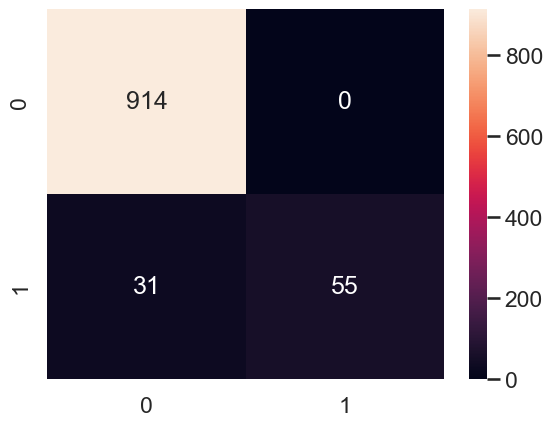

Predicting Diabetes
===================

***Utlizing Machine learning practices to analyze and predict diabetes***

**Author:** *Scott Bamford*

# Main Objective of Analysis: 

Being able to Predict the outcome of our data (Diabetes DataFrame)

# Explaination of the Dataset

Dataset consists of 9 Columns, 5 of these columns are categorical (All Nominal), and the other 4 are Continuous.

|Columns| Data Type| Type of Data (Python)|
|-------|----------|----------------------|
|gender	|Nominal | String |
|age| Ordinal | Float |
|hypertension	| Nominal| int64 |
|heart_disease	| Nominal| int64|
|smoking_history	| Nominal| int64|
|bmi	| Continuous| Float|
|HbA1c_level	| Continuous| Float |
|blood_glucose_level	|Continuous| Float|
|diabetes| Nominal| Nominal | Float |

My goal is to be able to predict Diabetes in this dataset based upon the features that are present. 

# Data Exploration And Data Cleaning Explaination 

Currently the cleaning of the data shows that Age, has a couple of mislabels, as well as both Gender and Smoking history will need to be incoded into a numeric version of itself. 

Diving deeper into the Age issue, it is found that there are 991 rows where the output is below 0. The reason why this is an issue is primarily having to do with the consideration that Age is going to be Ordinal and cannot have Decimal values. Normally I would've accepted this an continued forward, Which (I tested) and I do not beleive that this would provide enough evidence or analysis for the data as a whole esepcially since all 991 are below the age of 1 as well as do not have diabetes. So i have deceided to remove them from the dataset itself. 

## Reason for Excluding 991 

After testing the data specifically with the 991 for a basic summary we get the following results. With Hyper Paramater tuning (35,7) which was the same for both With and without 991 

|Score|train|test|
|-----|-----|----|
|accuracy|	0.971899|	0.969000|
|precision	|1.000000	|1.000000|
|recall	|0.669400	|0.635294|
|f1	|0.801965|	0.776978|

In Comparision to the outcome utilizing without the 991 

|Score|train|test|
|-----|-----|----|
|accuracy|0.971638|0.969000|
|precision|1.000000|1.000000|
|recall|0.669361|0.639535|
|f1|0.801936|0.780142|

This was optimized for Accuracy, and cleary what is shown here is that there isn't a difference in TESTING OUTPUT RESULTS ACCORDING TO Accuracy, but what is is most improatnt is the balancing error or score, which I am using F1, and without 991 it produces a slightly better score. 

# Model selection 

I have decided to utlize Decision tree, Random Forest, Random Tree and Bagging

## Decision Tree

In order to decide the best hyper paramters one must chose what Score we will be using inorder to produce the optmized version of these outputs, these outputs can be: Accuracy, Recall, and F1 and precision

These are the outputs of these tests 

### Accuracy Optimized - Hyperparamters (node_count - 35, max depth - 7)

|score	|train	|test|
|-|-|-|
|accuracy|	0.971638|	0.969000|
|precision|	1.000000|	1.000000|
|recall|	0.669361|	0.639535|
|f1| 0.801936       |	0.780142|

### F1 Optimized - Hyperparamters (node_count - 87, max depth - 9)

|score	|train	|test|
|-|-|-|
|accuracy|	0.971944|	0.968000|
|precision|	0.995276|	0.982143|
|recall|	0.676135|	0.639535|
|f1|	0.805237|	0.774648|

### Recall Optimized  - Hyperparamaters (node count - 9097, max depth - 31)

|score|	train|	test|
|-|-|-|
|accuracy|	0.997686|	0.947000|
|precision|	0.999268|	0.685393|
|recall|	0.973734|	0.709302|
|f1	|0.986336	|0.697143|

### Precision Optimized - Hyperparamaterse (node count - 3, max depth - 1)

|score	|train  | test|
|-|-|-|
|accuracy |0.947344|0.942000|
|precision|1.000000|1.000000|
|recall	  |0.386142|0.325581|
|f1	      |0.557147|0.491228|

## Results Interpretation 

Based upon the needs of the data which is to say, we want to have as many positive results that are correct than negative results since this is a PREDICTION OF DIABETIES, you would rather have more people be diagnosed and not have it then not be diagnosed and have it. So moving forward we will be utilizng the Recall Optimized results, alhtough it produces a significantly lower F1 score, our goal is to opimize the minimizing of false negatives there for that is the result we will be using. 

## Random Forest Vs ExtraTrees (For Comparison for Randomness)

### Random Forest Results 

|n_trees|	oob|
|-------|------|
|15.0	|0.034489|
|20.0	|0.033990|
|30.0	|0.033276|
|40.0	|0.032899|
|50.0	|0.033011|
|100.0	|0.032297|
|150.0	|0.032124|
|200.0	|0.031981|
|300.0	|0.031859|
|400.0	|0.031696|
|500.0	|0.031502|
|600.0	|0.031533|
|700.0	|0.031431|

Deciding on Choosing 300 as the number of trees 

with the Scores being 

|Score|  train|test|
|-|-|-|
|accuracy   |0.997839  |0.969000|
|precision  |0.998784  |0.966102|
|recall     |0.975992  |0.662791|
|f1         |0.987257  |0.786207|

## Extra Trees

	
|n_trees	|oob|
|-|-|
|15.0	|0.037089|
|20.0	|0.035753|
|30.0	|0.034357|
|40.0	|0.033541|
|50.0	|0.033256|
|100.0	|0.032328|
|150.0	|0.031910|
|200.0	|0.031859|
|300.0	|0.031818|
|400.0	|0.031736|
|500.0	|0.031706|
|600.0	|0.031696|
|700.0	|0.031757|

Decided on utlizing 150 as the n_estimator

|Score|  train |     test|
|-|-|-|
|accuracy   |0.997829 | 0.965000|
|precision  |0.998541 | 0.918033|
|recall     |0.976111 | 0.651163|
|f1         |0.987199 | 0.761905|

### Results Interpretation  

The choice to utilize Extra Trees as well was in order to provide additional context as well as prevent overfitting more apprantly since we didn't want this to over fit. Buyt as you can see, the randomness although prvent over fitting more readily didn't provide a signficant decrease or increase in accuracy score. Although the Addition of Extra Tree (more randomness) allowed for a similar Out of Box Error rate, but at a lower amount of trees needed. 

## Boosting

Error Curve for Gradient Boosting Classifier 

|n_trees|	error|
|-|-|
|15.0|	0.031|
|25.0|	0.031|
|50.0|	0.031|
|100.0|	0.033|
|200.0|	0.034|
|400.0|	0.034|

The results show we should use 50 for number of Trees 

After Optimizing Hyperparamter Tuning for Learning Rate and Subsample Got 0.1 learning rate and 0.25 subsample 

|Score      |train     |test
|-|-|-|
|accuracy   |0.971730  |0.969000
|precision  |0.996829  |1.000000
|recall     |0.672570  |0.639535
|f1         |0.803208  |0.780142

Confusion Matrix

### Results Interpretation 
Bosting again seems to have yeilded simalar results to the others tests, athough it would be apparent to see that with these result it makes the depth of trees lower than normal, 

# Final Model Selection 

Best Suited Model - random Forests based upon the results as well as this being both a classification model as well as something that can be used in tandom with a lot of "Categorical" features. 

## Chosen -  Random Forest 
|Decision Tree - Accuracy|Random Forest|Extra Trees|Boosting|
|:------:|:-----------:|:---------:|:------:|
|0.969000|*0.969000*|  0.965000|0.969000|
|*1.000000*|0.966102|  0.918033|1.000000|
|0.639535|0.662791|  **0.651163**|0.639535|
|0.780142|**0.786207**|  0.761905|0.780142|

Confusion Matrix For Model - Random Forest

ROC AUC Score 

From these finding s it would appear with a 96% accuracy, utlizing Random Forests we're able to get a pretty accuracte prediction based upon the 9 features provided by this dataset.
Although I do believe this value iteself could be raised specifically the F1 score, the goal of the dataset and the study wasn't to get optimal F1 but instead get best Accuracy, the secondary objective when Accuracy was tied (as it was here) was to look at the results holestically (through the F1). 

Major flaws so far are 

1. Lack of Well spread out data (0.9 Non Diabietes to 0.1 diabetes)
2. Only 9 features (Could use a lot more especially  since they do not provide as much context as possible since 5 of the 9 are Categorical by nature)

## Next Steps 

The next steps from this model would be to add additional features, as well as potentially looking into adding Location. This could be a major factor as well type of job (employmnet) and the type of employment could be an additional thing to add if this would be possible on top of this survey. 