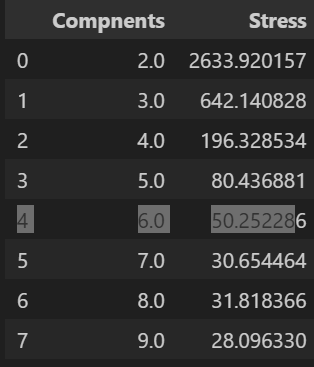
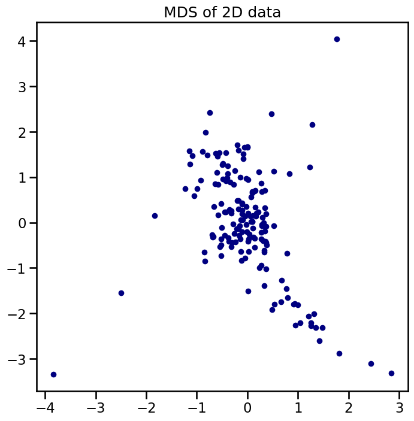

# Feature Selection and Dimensionality Reduction of Country Data 

## Main Objectives 
The main objective of this report is to reduce the number of features in this dataset to the most important as well as the one which accounts for the dataset itself. 

**PCA** - Linear Method that finds the principle copnents of the data 

**Kernal PCA** - Maps Data into a higher dimensionalit spaces allowing for capture of non linear relationships. Transformes the data into higher dimensionality to help identify and handle non linearly sperable data.

**MDS** - Aims to reduce dimensionality while highlighting and preserving the distances bewteeen points as it lower dimensionality. 


## Data Set 
* country: Name of the country
* child_mort: Death of children under 5 years of age per 1000 live births
* exports: Exports of goods and services per capita. Given as %age of the GDP per capita
* health: Total health spending per capita. Given as %age of GDP per capita
* imports: Imports of goods and services per capita. Given as %age of the GDP per capita
* Income: Net income per person
* Inflation: The measurement of the annual growth rate of the Total GDP
* life_expec: The average number of years a new born child would live if the current mortality patterns are to remain the same
* total_fer: The number of children that would be born to each woman if the current age-fertility rates  remain the same.
* gdpp: The GDP per capita. Calculated as the Total GDP divided by the total population.

This Dataset covers 167 Countrys and provides the information above. As well as this I've taken the time to update the dataset speicfically to change the Percentages for Exports, Health, and Imports to actual values using the GDPP 

using this formula 

                                Actual Value = Percentage Value * GDPP / 100

As a result this is the output from the dataset itself (summarized) 


This is also the relationships between each coloumn itself. 


The Data itself is not missing any values, but does have values in the negatives. Each column having a high overall absolute value correlation in total. Not only this but each has a high Skew as well (This isn't suprising based upon how different countries are at either different stages in both Health and Economic Boom) 


Decided Against correcting for Skew because it minimilizes the impact of the dataset as well as causes issues later on with feature scaling. In terms of choices I will be scaling the data since this provides both a better outcome for feature scaling as well as if I wanted to use it for KMeans as well as Agglomorative Custering (ward) 


## Findings 

**PCA** 

When running through 1 - 9 different types of Dinensions, these are the results. 


*According to the graph, the amount of features, that account for the most significant amount of the dataset is 5. 


**Kernel PCA**

When Running and optimizing the Kernel PCA, with 

```
param_grid = 
    'gamma': [0.001,0.01,0.1,0.5,1.0],
    'n_components': [2,3,4, 5,6,7,8,9]
```
The best result was gamma of 0.5 and a number of components of 9. After re running and looking for the Explained variance and ratios, the results displayed that similar to PCA, around 5 was the number of features that would explain the dataset. 


**MDS Multi Dimensional Scaling** 

To Reduce the Number of Dimensions down. 

In Comparision to PCA and Kernel the Number of Compnoents that was used was 9 then chosen the final, and then from that you would utilize the best captured columns based upon variance. Unfortuently MDS doesn't work the same way. It's goal is to protect the distances between values and features. So We'll be using Stress as a good indicator of results. 

Below shows a slight divergance from PCA and Kernal, showing that around 7 components produce the best resultss, and additional values only resudce the stress minimally. 







# Results / Conclusion 

PCA and Kernal PCA both produced an outcome where when feature selecting I found that 5 features post PCA (Kernal and Other) produced enough of data sets variance and Feature weights. While when using MDS, it showed that 7 features (reduction) was the most optimal, in regards to reducing the features. I believe that in terms of Feature Reduction I would chose PCA (non kernal). MDS and Kernel both produced useful results, but PCA was able to account for more of the data with fewer actual columns itself. Such as at 4 Features, PCA produced 93 variance, while for Kernal it was 0.82. And for MDS there was a 196 stress, which is way to high for me to accept as a valaid reduction. 


